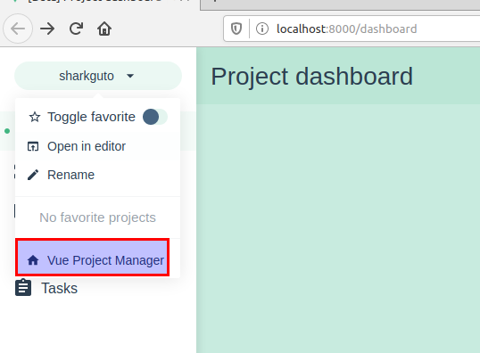

# dojo aprendendo vue

## topicos

1. instalação
2. configuração inicial
3. rotas
4. vuex
5. axios -> fazer requisições mock
6. jest -> test unitario

## instalação

```bash
sudo snap install node --channel=10/stable --classic
sudo npm i -g @vue/cli --scripts-prepend-node-path
```

## configuração inicial

```bash
vue ui
```

voce vera uma tela parecida com essa


criar novo projeto




mock url http://www.mocky.io/v2/5e3aff812f0000dce656c867